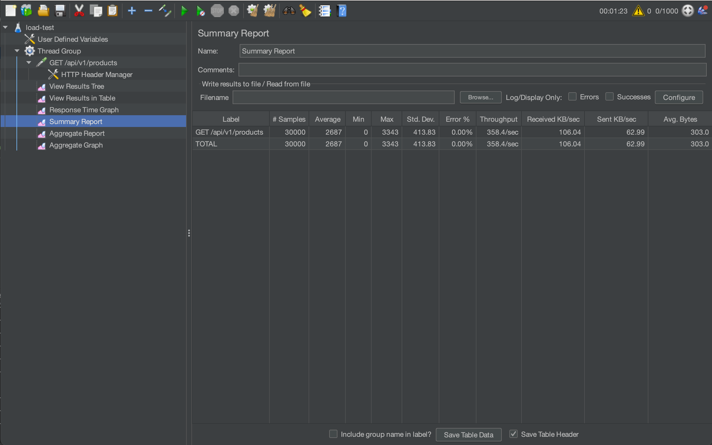
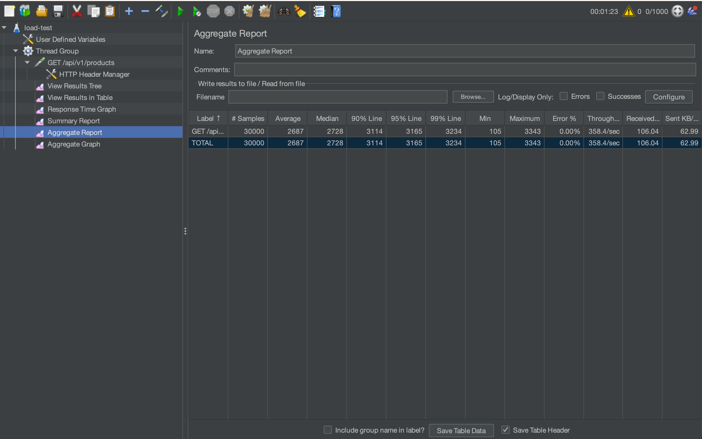

# Load Testing Using Apache JMeter

Load testing is a critical aspect of assessing the performance and stability of our applications and services when subjected to real-world usage conditions. It involves simulating a significant number of concurrent users or transactions to gauge how well our system can handle the load.

In this project, we demonstrate how to leverage Apache JMeter to conduct load testing effectively.

## Getting Started

### Apache JMeter Installation

#### macOS (Using Homebrew):
1. Install JMeter using Homebrew:
    ```
    brew install jmeter
    ```
2. Start JMeter:
    ```
    jmeter
    ```

#### Windows:
1. Visit the Apache JMeter website and download the latest version of JMeter.
2. Extract the downloaded archive to your preferred location.
3. Run the jmeter.bat (Windows) script from the bin directory to start JMeter.

## Running Tests
1. Open an existing test plan or create a new one.
2. Add test elements such as user defined variables, thread groups, and listeners to your test plan.
3. Configure the test elements with the necessary settings.
4. Save your test plan.
5. Click "Start" to run your test plan.
6. Monitor and analyze the test results using JMeter's various listeners.


## Test Plan Structure
1. `Thread Group`: Defines the number of users (threads) and how they behave during the test.
2. `Samplers` (under `Thread Group`): Represent the requests that will be sent to the target server.
3. `Config Elements`: Configure variables, data files, and other settings used in the test.
4. `Listeners`: Capture and display the test results.
5. `Timers`: Add delays or pacing between requests.
6. `Assertions`: Define criteria for determining whether a test is successful or not.

## Running and Analyzing Tests
During test execution, use JMeter's listeners to view and analyze the results. Commonly used listeners include:

1. `View Results Tree`: Displays detailed information about each request and response.
   
2. `Summary Report`: Provides summary statistics of the test.
   
3. `Aggregate Report`: Offers aggregate statistics like average response time and throughput.
   
4. `Response Time Graph`: Displays a graphical representation of response times for the various requests in your test plan over the duration of the test run.  It can help you identify performance issues that may only become apparent when the system is under load.
   

## References
1. https://jmeter.apache.org/usermanual/get-started.html
2. https://www.educba.com/jmeter-summary-report/